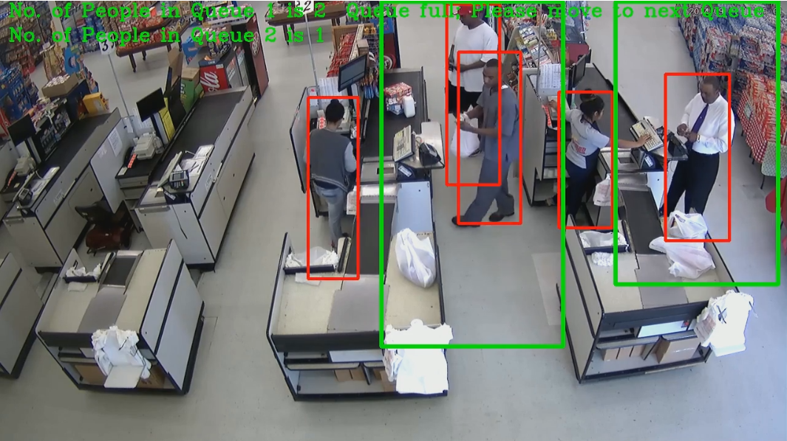

 # Smart Queue Monitoring System
This project deals with detecting people in queues (in order to redirect them to shortest queue) 
using inference on pre-trained neural network with Intel OpenVINO framework. 
The idea is to choose hardware most suited for particular task (scenario). 

## Proposal Submission
The type of hardware chosen for each of the scenarios:
- Manufacturing: CPU + FPGA
- Retail: CPU + Integrated GPU
- Transportation: CPU + VPU

## Project Set Up and Installation
Project setup procedure included the following steps:
* Connect to Intel DevCloud, setup developer account, and create or upload jupyter notebook in the DevCloud 
  to have access to the DevCloud environment
* Downloading the pre-trained model from OpenVINO model zoo: person-detection-retail-0013. 
  IR (Intermediate Representation) consists of two files: 
  [xml](https://download.01.org/opencv/2020/openvinotoolkit/2020.1/open_model_zoo/models_bin/1/person-detection-retail-0013/FP16/person-detection-retail-0013.xml),
  [bin](https://download.01.org/opencv/2020/openvinotoolkit/2020.1/open_model_zoo/models_bin/1/person-detection-retail-0013/FP16/person-detection-retail-0013.bin). 
  Downloading can be performed using OpenVINO's Model Downloader, or by using `wget` and direct links:
  
  `!wget https://download.01.org/opencv/2020/openvinotoolkit/2020.1/open_model_zoo/models_bin/1/person-detection-retail-0013/FP16/person-detection-retail-0013.xml`
  
  `!wget https://download.01.org/opencv/2020/openvinotoolkit/2020.1/open_model_zoo/models_bin/1/person-detection-retail-0013/FP16/person-detection-retail-0013.bin`
  
  The downloaded model was placed in the `model` sub-directory of the home dir in the virtual environment 
  running jupyter notebook. This ensures that it will be made available to the virtual host running the actual job.  
   
* Check that command line tools like `qsub`, `qstat`, `qdel` etc. are available 
  to submit, delete and query status of DevCloud Jobs
* Install dependencies required by the project using `pip` from the jupyter notebook, for example:
  `!pip3 install ipywidgets matplotlib`  

## Documentation
The project code is mainly located in the following files:
* `person_detect.py` - Python script containing the main inference code: 
  initialising OpenVINO core, loading the network to make it ready for inference, 
  loading and processing the input MP4 file, and outputting the resulting MP4 file with bounding boxes.
  Two sets of bounding boxes are added to the original file: green - for the location of the queuing areas, 
  red - for the location of the people found in frame.
  Additionally, the script outputs `stats.txt` file with information on total people and the number of 
  people in each queue area per frame. 
  Measures of loading and total inference time are also written at the end of this file.

The three jupyter notebooks for each of the scenarios:
* `people_deployment-manufacturing.ipynb` - Manufacturing (worker queues at conveyor belt on the factory floor)
* `people_deployment-retail.ipynb` - Retail (customer queues at cashier counters at the grocery store) 
* `people_deployment-transportation.ipynb` - Transportation (passenger queues at the busy metro station)

Each notebook make use of the `person_detect.py` script to make inference. It follows the same pattern:
* Creates job script
* Submits 4 jobs using this script to the DevCloud, using same video for particular scenario, but different hardware: 
  * IEI Tank 870-Q170 edge node with an Intel® Core™ i5-6500TE (CPU)
  * IEI Tank 870-Q170 edge node with an Intel® Core™ i5-6500TE (CPU + Integrated Intel® HD Graphics 530 card GPU)
  * IEI Tank 870-Q170 edge node with an Intel® Core™ i5-6500TE, with Intel Neural Compute Stick 2 (Myriad X)
  * IEI Tank 870-Q170 edge node with an Intel® Core™ i5-6500TE, with IEI Mustang-F100-A10 card (Arria 10 FPGA).
* Shows results of each job:
  * Video with bounding boxes
  * Model loading time 
  * Average Inference time per frame
  * Inference FPS (frames per second)
     
## Results

Here is an example frame from the video output in the Retail scenario.
The queuing areas are marked with green boxes, and the people with red ones.
It can be seen that first queue is determined as full (max people = 2):

#### Manufacturing

| Device	 | Inference Time(s) | FPS		 | Load Time(s)	 |
|------------|-----------------------|---------------|---------------|
| CPU   	 | 11.3			 | 24.425	 | 1.236	 |
| GPU   	 | 11.2			 | 24.643	 | 35.004	 |
| FPGA   	 | 9.2			 | 30.000	 | 28.722	 |
| MYRIAD   	 | 44.4			 | 6.216	 | 2.590	 |

#### Retail
 
| Device	 | Inference Time(s)	 | FPS		 | Load Time(s)	 |
|------------|-----------------------|---------------|---------------|
| CPU   	 | 4.4			 | 37.727	 | 1.177	 |
| GPU   	 | 5.4			 | 30.741	 | 35.072	 |
| FPGA   	 | 3.9			 | 42.564	 | 29.141	 |
| MYRIAD   	 | 25.3			 | 6.561	 | 2.550	 |

#### Transportation

| Device	 | Inference Time(s)	 | FPS		 | Load Time(s)	 |
|------------|-----------------------|---------------|---------------|
| CPU   	 | 16.7			 | 19.760	 | 1.269	 |
| GPU   	 | 15.8			 | 20.886	 | 34.351	 |
| FPGA   	 | 13.6			 | 24.265	 | 28.783	 |
| MYRIAD   	 | 49.8			 | 6.627	 | 2.587	 |

## Conclusions
The fastest inference is on FPGA, although takes longer to load the model.
CPU and GPU are almost the same on inference, with GPU a little longer of inference and much longer on loading the model.
Finally, inference is slowest on VPU (NCS2 Compute Stick with Myriad X).
Yet, in real life inference speed is not the only consideration.
Often, it is also the cost, space or other requirements like the need to keep CPU reserved for other tasks.
All of this should be taken into account when choosing the right hardware for inference.

In summary, my take is as follows:
* NCS2 is slower but great when cost is priority, as well as ease of existing hardware extension.
* FPGA is very fast due to its architecture, but much more costly and requires additional skills to be (re-)programmed.
* CPU still offers great speed and is optimal when both inference & model loading time are considered.
* GPU is great in cases when it is integrated with a CPU, offering almost same speed as CPU, but allowing to offload the CPU for other tasks. 

## Note on Hetero Plugin
The FPGA option in this project was used with OpenVINO's Hetero plugin, with a fallback to CPU
whenever an operation/layer was not supported. This is very helpful when not all of the layers 
are programmed into the FPGA, since one can still use the FPGA for performance boosting 
without the need to re-program FPGA.    
