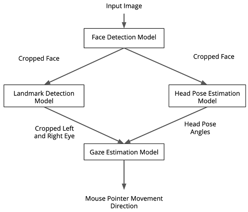

# Computer Pointer Controller

The goal in this project is to determine gaze direction of a person in the image, or video stream 
(from video file or camera), using Intel OpenVINO toolkit. As one of the applications of 
gaze detection, mouse pointer could be moved in the direction of the person's gaze.

At the core of the project is building a 'pipeline', i.e. series of neural networks that use 
one network's output as input to one or more other networks. 

Below is the design of the pipeline, using 4 networks from OpenVINO Model Zoo:
 
 

## Project Set Up and Installation
I used Ubuntu 18.04 on VirtualBox for this project. These were the preparation steps:
* Install OpenVINO Toolkit as described 
[here](https://docs.openvinotoolkit.org/latest/_docs_install_guides_installing_openvino_linux.html)
* Make OpenVINO variables available: `source /opt/intel/openvino/bin/setupvars.sh`
* Required dependencies installed via `pip install -r requirements.txt`
* Download all required models using OpenVINO model downloader and place under `models` sub-directory: 
    * `./downloader.py --name face-detection-adas-binary-0001 -o ~/Projects/mouse-pointer-controller/models/`
    * `./downloader.py --name head-pose-estimation-adas-0001 -o ~/Projects/mouse-pointer-controller/models/`
    * `./downloader.py --name landmarks-regression-retail-0009 -o ~/Projects/mouse-pointer-controller/models/`
    * `./downloader.py --name gaze-estimation-adas-0002 -o ~/Projects/mouse-pointer-controller/models/`
* Implement model loading and inference in python files:
    * `face_detection.py`
    * `head_pose_estimation.py`
    * `landmarks_regression.py`
    * `gaze_estimation.py`
* Implement feed iteration for single image and video stream in `input_feeder.py`
* Implement main logic putting pieces together in `main.py`

## Demo
Below id the example frame from a processed video file showing the detected gaze direction
of a person in the video:

 

## Documentation
The `main.py` has the following parameters:
* `--type`: 'image', 'video' or 'cam'
* `--file`: image or video file
* `--precision`: optional, precision of mouse movement
* `--speed`: optional, speed of mouse movement

Precision and speed parameters can be left empty to omit mouse movement.
The pyautogui library does not support mouse control in Virtual environments like VirtualBox, 
so in order to check correctness, vector projections were drawn over the person's eyes.
In non-virtualized environments, the code should work correctly, moving the mouse pointer
in the direction of the person's gaze.

To run the demo on an image:

    python main.py --type image --file ../bin/demo.png

To run the demo on a video file to draw detected gaze vector projections:

    python main.py --type video --file ../bin/demo.mp4

To run the demo on a video file to additionally move the mouse pointer:

    python main.py --type video --file ../bin/demo.mp4 --precision high --speed fast

To run the demo on a cam video stream and move the mouse pointer:

    python main.py --type cam --precision high --speed fast
   

## Benchmarks
*TODO:* Include the benchmark results of running your model on multiple 
hardwares and multiple model precisions. Your benchmarks can include: model loading time, 
input/output processing time, model inference time etc.

## Results
*TODO:* Discuss the benchmark results and explain why you are getting the results you are 
getting. For instance, explain why there is difference in inference time for 
FP32, FP16 and INT8 models.

## Stand Out Suggestions
This is where you can provide information about the stand out suggestions that you have 
attempted.

### Async Inference
If you have used Async Inference in your code, benchmark the results and explain its 
effects on power and performance of your project.

### Edge Cases
There will be certain situations that will break your inference flow. 
For instance, lighting changes or multiple people in the frame. 
Explain some of the edge cases you encountered in your project and how you solved 
them to make your project more robust.
